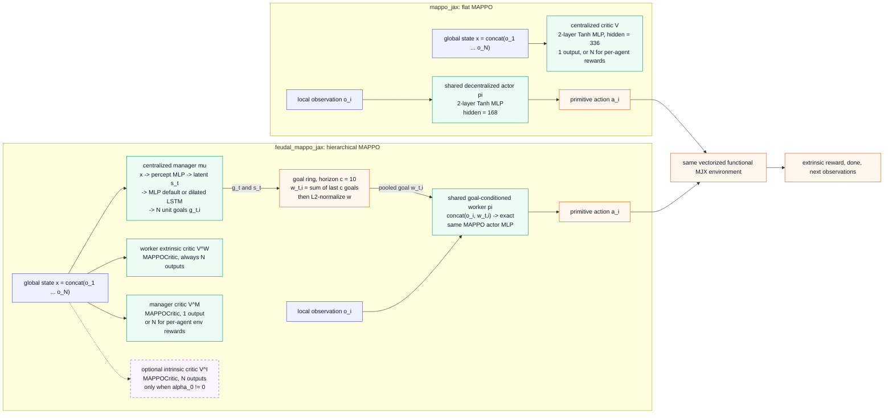
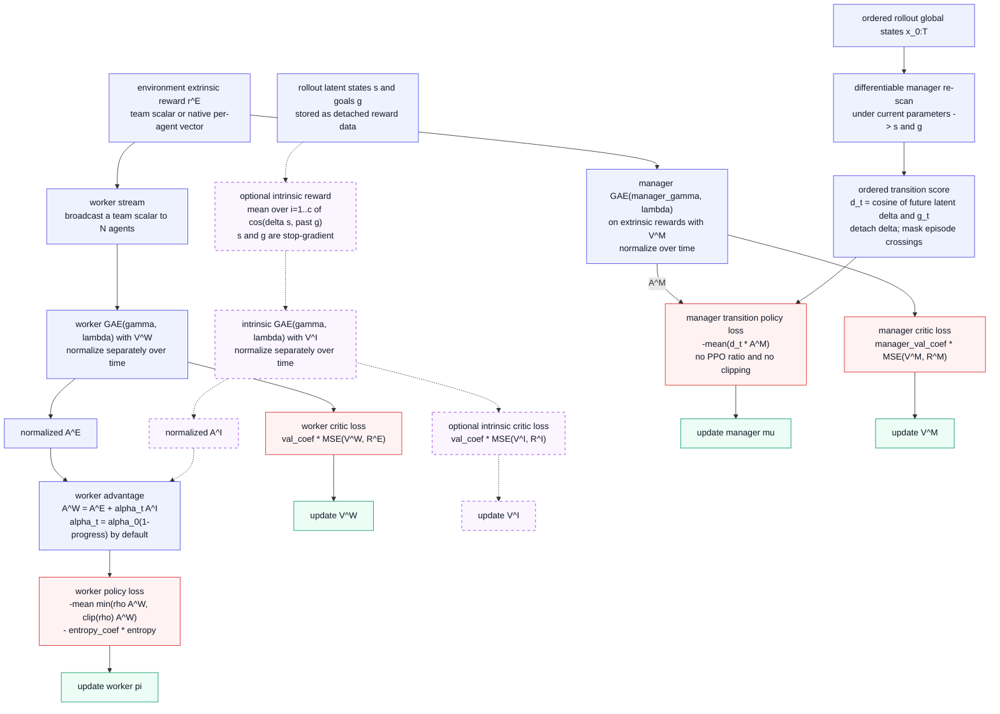

# `feudal_mappo_jax`: models, losses, and the difference from `mappo_jax`

This note describes `algorithms/feudal_mappo_jax` and
`algorithms/mappo_jax`. In the diagrams, `E` is the number of parallel
environments, `N` the number of agents, `c` the goal horizon, and `D` the goal
dimension.

## Model and rollout architecture



The actor head in both implementations is categorical for a discrete environment
and a diagonal Gaussian for a continuous one. The copied `network.py` files are
byte-identical: the feudal worker changes the actor input, not its action
distribution or MLP body.

Before concatenation, the worker L2-normalizes the pooled goal by default. An
optional bias-free `goal_embed_dim` projection can be inserted there; its default
is `None`. The `zero_goal` switch is an ablation that zeroes this input without
changing the worker parameter-tree shape.

The manager itself is:

```text
global state x_t: (E, N * obs_dim)
  -> f_percept: Dense(256)-Tanh-Dense(256)-Tanh
  -> f_Mspace: Dense(N * D)
  -> state latent s_t: (E, N, D)
  -> flatten agent/goal axes
  -> core: Dense(256)-Tanh [default] OR dilated LSTM(256, radius=c)
  -> goal head: Dense(N * D)
  -> per-agent L2 normalization
  -> goal g_t: (E, N, D)
```

`s_t` is a bottleneck rather than a diagnostic side head: the core consumes it.
That lets `f_Mspace` still receive gradient through the goal branch after the
manager loss detaches the observed state-transition branch.

## Training objectives



The dashed purple `r^I` / `V^I` branch is absent when `intrinsic_coef == 0`, the
shipped default. In that configuration, the worker is still goal-conditioned
and the manager is still trained. The manager loss re-runs the manager over the
ordered stored global states because `g_t` must remain differentiable; it does
not optimize against the detached goals saved at action time.

Each GAE stream uses

```text
delta_t = r_t + gamma (1-d_t) V_{t+1} - V_t
A_t = delta_t + gamma lambda (1-d_t) A_{t+1}
R_t = A_t + V_t
```

The shared worker PPO surface in both implementations is

```text
rho_t(theta) = exp(log pi_theta(a_t | input_t)
                   - log pi_old(a_t | input_t))

L_policy = -masked_mean(min(rho_t A_t,
                            clip(rho_t, 1-epsilon, 1+epsilon) A_t))
L_entropy = -masked_mean(entropy(pi_theta))
L_value = masked_MSE(V, R)

logged L_total = L_policy + ent_coef L_entropy + val_coef L_value
```

The actor and each critic have separate Adam optimizers, so `L_total` is a
combined statistic rather than one joint backward pass. `V^I`, `V^M`, and the
manager policy also have their own objectives and are not folded into the logged
worker `L_total`.

For the manager,

```text
d_t = cos(stopgrad(s_{t+c} - s_t), g_t)
L_manager_policy = -masked_mean(d_t * stopgrad(A^M_t))
```

This is a full-batch, time-ordered transition policy-gradient pass. It is not
PPO: there is no goal log-probability, importance ratio, or clip. The default is
one manager policy epoch because repeating this uncorrected objective would be
off-policy. The independently supervised `V^M` gets eight epochs by default.

## What differs from `mappo_jax`

| Concern | `mappo_jax` | `feudal_mappo_jax` |
|---|---|---|
| Policy input | Each actor sees only local `o_i`. | Each worker sees `concat(o_i, normalize(sum of last c goals for i))`. |
| Actor body / action distribution | Shared 2-layer Tanh actor; categorical or diagonal Gaussian. | Exact same actor body and distribution, wrapped by `FeudalWorker`. |
| High-level model | None. | Centralized manager emits one latent direction per agent. Default core is an MLP; dilated LSTM is optional. |
| Value models with dense team reward | One scalar centralized critic. | Always-per-agent worker critic plus scalar manager critic; optional per-agent intrinsic critic. |
| Learned optimizer states | 2: actor and critic. | 4 by default: worker, worker critic, manager, manager critic; 5 when `intrinsic_coef != 0`. |
| Policy advantage | Normalized extrinsic GAE. | Normalized extrinsic GAE plus optional independently normalized/annealed intrinsic GAE. |
| Policy update | Clipped PPO. | Same clipped PPO for the worker, plus a separate unclipped manager transition objective. |
| Temporal rollout state | Environment/PRNG state only. | Also manager carry and a `c`-slot per-agent goal ring. The exact pooled goal used to act is stored for a valid PPO ratio. |
| Default intrinsic path | Not present. | Off (`intrinsic_coef: 0.0`); goals and manager learning remain active. |

Therefore, `feudal_mappo_jax` with `intrinsic_coef=0` is **not** equivalent to
flat `mappo_jax`. It still differs in three material ways: goal conditioning,
an always-per-agent worker critic, and manager training. Use
`algorithm=mappo_jax model=mlp` as the flat baseline, not the zero-intrinsic
feudal arm.

## Source map

- Flat actor, critic, and action distributions:
  [`../mappo_jax/network.py`](../mappo_jax/network.py)
- Flat GAE and PPO losses:
  [`../mappo_jax/mappo.py`](../mappo_jax/mappo.py)
- Flat rollout/update flow:
  [`../mappo_jax/trainer.py`](../mappo_jax/trainer.py)
- Goal-conditioned worker: [`worker.py`](worker.py)
- Manager architecture and goal semantics: [`manager.py`](manager.py)
- Feudal train states and losses: [`mappo.py`](mappo.py)
- Feudal rollout/update orchestration: [`trainer.py`](trainer.py)
- Defaults: [`../../conf/algorithm/feudal_mappo_jax.yaml`](../../conf/algorithm/feudal_mappo_jax.yaml)
  and [`../../conf/algorithm/mappo_jax.yaml`](../../conf/algorithm/mappo_jax.yaml)
